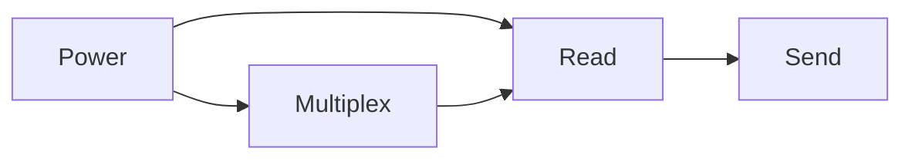

# Scale Bridge design

## FP0 : Power
3.3V operation
The bridge should be powered with a battery for the sake of convenience.
As seen on the above graph, power is supplied to both the ESP8266 MCU and the Multiplexer.

## FP1 : Read
Signals should be between 0 and 1V to be read by the MCU.
Voltage divider should decrease the input voltage to the ADC under 1V
That means this should remain true for resistor selection :
V~0~/3.3 <= R2/(R2+R1)
Values for the resistors can vary since we are only measuring digital and not analog signals.

## FP2 : Multiplex
74HC4067 16:1 analog multiplexer will allow us to view all 13 pins with GPIO output.

## FP3 : Send
MQTT client connected to a client on the same network will send data and timestamp
